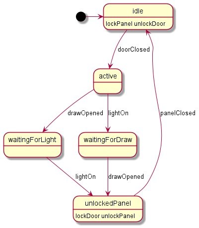
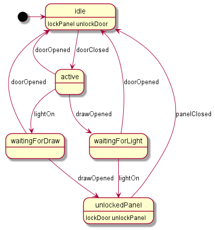
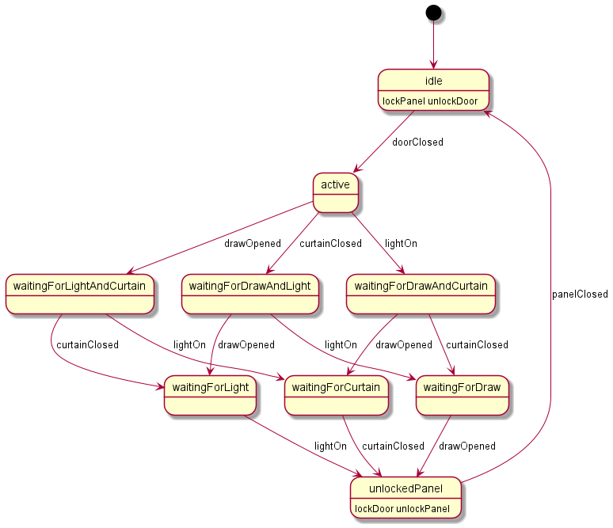
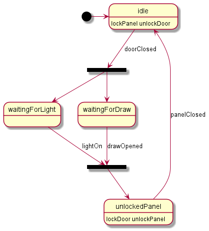
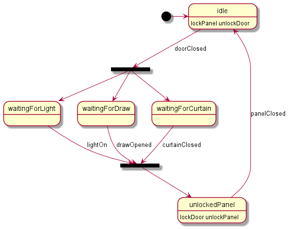

= Evolving Domain-Specific Languages
:author: Konstantin Plotnikov
:docdate: 2022-05-05

When designing domain-specific languages (DSL), the most critical choice is the selection of concepts that form the basis of the language. Sometimes concepts for the language come from the customer directly or from domain traditions. Sometimes the DSL developers force customers to use what they are already familiar with. Implementing these concepts in the DSL as close to the domain as possible is usually a good choice so the language will be readily understood by domain experts. However, instead of sticking to the existing domain concepts, it is also possible to evolve domain concepts by designing higher-level concepts based on existing concepts. In this article, I’ll demonstrate how such an evolution could be done using a classic state machine language as an example.

== State Machine Language
Martin Fowler wrote a classic book called "https://martinfowler.com/books/dsl.html[Domain-Specific Languages]". This is a really good book, and I recommended reading it if you have plans to go into DSL design. The state machine sample from that book is copied from an article, and a lot of DSL framework developers and language workbench developers demonstrate the capabilities of their tools based on this state machine language. This language has become a kind of a DSL tool benchmark language. The sample is in the following code block (one of many variants. I've tried to compare to the one that is implemented for Xtext version of the language at the blog post by Sven Efftinge, "http://blog.efftinge.de/2012/05/implementing-fowlers-state-machine-dsl.html[Martin Fowler's State Machine DSL with Xtext 2.3]"):

[source]
----
events
    doorClosed
    drawOpened
    lightOn
    reset doorOpened
    panelClosed
end

commands
    unlockPanel
    lockPanel
    lockDoor
    unlockDoor
end

state idle
    actions {unlockDoor lockPanel}
    doorClosed => active
end

state active
    drawOpened => waitingForLight
    lightOn    => waitingForDraw
end

state waitingForLight
    lightOn => unlockedPanel
end

state waitingForDraw
    drawOpened => unlockedPanel
end

state unlockedPanel
    actions {unlockPanel lockDoor}
    panelClosed => idle
end
----
(If you click at the end of the listing, the remaining part of it will be shown.)

Try not to look at the diagram below and try to understand what a state machine actually does. It is easy to get a general idea, but I had to draw the diagram using PlantUML to get a complete picture. This is a case when words are not quite enough and this is a really suspicious smell for DSL. DSLs are designed to help your understanding, after all.

I’ll provide diagram sources here, to give readers the possibility to play around with them later. There will be no GitHub for this article. And I’ll use an AsciiDoc diagram with embedded syntax that could be easily changed to other forms.

[source, asciidoc]
----
[plantuml]
.State Machine
....
[*] -> idle
state idle :  lockPanel unlockDoor
idle --> active : doorClosed
active --> waitingForLight : drawOpened
active --> waitingForDraw : lightOn
waitingForLight --> unlockedPanel : lightOn
waitingForDraw --> unlockedPanel : drawOpened
state unlockedPanel : lockDoor unlockPanel
unlockedPanel --> idle : panelClosed
....
----

It is possible to generate diagrams from this description in a lot of places. I personally use the AsciiDoc plugin in the IntelliJ IDEA Community Edition because it gives fast feedback, and the local file is not going anywhere if the browser tab is closed by mistake. However, there are even online sites that allow generating diagrams from PlanUML like https://www.planttext.com/[PlantText] or https://plantuml-editor.kkeisuke.com/[PlantUML Editor]. The diagram specified above results in the following:

Now, it is much easier to understand what happens with that DSL. At least it is easy to trace possible paths.

There is also the `doorOpened` reset event in the language, and DSL does not explicitly say where it resets us too. It returns to the start state then to idle state, so the actual diagram is like the following:

[source, asciidoc]
----
[plantuml]
.State Machine With doorOpen
....
[*] -> idle
state idle :  lockPanel unlockDoor
idle --> active : doorClosed
active --> waitingForLight : drawOpened
active --> waitingForDraw : lightOn
active --> idle : doorOpened
waitingForLight --> unlockedPanel : lightOn
waitingForLight --> idle : doorOpened
waitingForDraw --> unlockedPanel : drawOpened
waitingForDraw --> idle : doorOpened
state unlockedPanel : lockDoor unlockPanel
unlockedPanel --> idle : panelClosed
....
----

With the following diagram:

This quickly gets complicated, and this is why in the model the reset event is specified implicitly, as this would become even harder to understand because of the number of transitions and states.

=== Designing a Higher-Tier Language
In my article about abstraction tiers, I’ve claimed that the concepts from higher tiers specifically help with these quantitative/horizontal complexity problems. Let’s attempt to design a higher-tier language as an alternative for state machines and check that claim.

Martin Fowler states that machine language is a tier two language. It has a flat namespace and go tos within this flat namespace. The difficulty of reasoning about the state machine is much related to what Edsger Dijkstra wrote in his article https://www.cs.utexas.edu/users/EWD/transcriptions/EWD02xx/EWD215.html[Go To Considered Harmful (originally "A Case against the GO TO Statement")]:

[quote,Edsger Dijkstra,Go To Considered Harmful]
My second remark is that our intellectual powers are rather geared to master static relations and that our powers to visualize processes evolving in time are relatively poorly developed. For that reason we should do (as wise programmers aware of our limitations) our utmost to shorten the conceptual gap between the static program and the dynamic process, to make the correspondence between the program (spread out in text space) and the process (spread out in time) as trivial as possible.

In this article, I’ll attempt to lift the state machine language to tier three, which corresponds to structured programming by eliminating explicit state transitions and states (a conceptual go to equivalent). It looks like the most important part of the domain is not states but events and commands and their ordering, since they are things that connect state machines to the external world, and they are observable. If the definition in one language processes events and commands in the same way as the definition in another language, I’ll consider the two definitions equivalent.

Many readers have possibly used a tier-three language that is compiled to a specific kind of state machine — regular expressions. They have a notorious reputation for being hard to understand. However, they are much easier to understand than the finite automata under them.

I’ll proceed in a similar way and create a language that allows for the expression of the same behavior as in the sample state machine.

Let’s design basic elements. I’ll use caps for keywords in order to distinguish them in samples.

* There is a need to wait for events, and it will be a statement like `WAIT doorClosed`. When the process gets to this statement, it will wait until the event is received and then proceeds to the next statement.
* There is a need to execute commands, and it will be a statement like `DO lockPanel, unlockDoor`. When the process gets to this statement, it executes commands in sequence and proceeds to the next statement.
* There is a need for blocks as organizing units. In the block, all statements will be executed sequentially.
* Also, there is a need for a choice operator like “|” in regular expressions. Here it will be expressed as an `ALT {…} OR {…}` statement. The semantics, like with regular expressions, will match statements in any branch, and if any branch is complete, it exits. There is a complication with DO statements; one of the options is to specify that the DO statement commits choice when the operator is executed.
* Now there should be an infinite loop to support the sample state machine. To do this, there will be just a `LOOP {…}` operator that loops its content infinitely. The model does not need a conditional loop or conditional statement yet, so I’ll leave them as an exercise for readers.
* And finally, there is a reset event doorOpened that should be handled as well. To handle it, the statement `ESCAPE doorOpened {…}` will be added to the language. The semantics are the following: if the specified event happens within a block on any `WAIT` statement, the control is transferred to after the statement `ESCAPE`. This is a kind of structured go to statement like break or continue in Java.

So, the equivalent of the original state machine will look like the following (the event and command declarations are assumed to be the same):

[source]
----
LOOP {
    ESCAPE doorOpened {
        DO lockPanel, unlockDoor
        WAIT doorClosed
        ALT {
            wait drawOpened
            wait lightOn
        } OR {
            wait lightOn
            wait drawOpened
        }
        DO lockDoor, unlockPanel
        WAIT panelClosed
    }
}
----

Note that if the event `doorOpened` happens, the execution exits the statement `ESCAPE` and the statement `LOOP` brings us back to the beginning, where a panel is locked, a door is unlocked, and the process waits for the door to close. Also note that `doorOpened` is unable to happen normally while the process is waiting for `panelClosed` because the door is locked at this point, but if it is forced, the process will still move to the beginning on loop.

The structured equivalent of a state machine is a bit shorter than the original definition. And these lines are easier to understand because the control flow is more obvious. It is possible to use spatial relationships to understand the temporal relationship between the step of a new event/command machine. It still could be directly compiled to the original state machine. The comment below marks the original states.

[source]
----
LOOP {
    ESCAPE doorOpened {
        DO lockPanel, unlockDoor
        // idle state
        WAIT doorClosed
        // active state
        ALT {
            wait drawOpened
            // waitingForLight state
            wait lightOn
        } OR {
            wait lightOn
            // waitingForDraw state
            wait drawOpened
        }
        DO lockDoor, unlockPanel
        // ulockedPanel state
        WAIT panelClosed
    }
}
----

In the new language, the state names are irrelevant, as it is possible to directly reason about events and commands that are observable parts of the language. States were just a private part of the language that organized behavior related to events and commands, and the new language provides new private parts that are capable of organizing the same behavior related to the same events and commands. Observable behavior is the same.

In the article "https://martinfowler.com/bliki/SyntacticNoise.html[SyntacticNoise]" by Martin Fowler, he wrote the following:

[quote, Martin Fowler, SyntacticNoise]
In [Gilhad Braha's] talk he illustrated noise by coloring what he considered to be noise characters. A problem with this, of course, is this requires us to define what we mean by noise characters. I'm going to side-step that and make a different distinction. I'll distinguish between what I'll call domain text and punctuation. The DSL scripts I'm looking at define a state machine, and thus talk about states, events, and commands. Anything that describes information about my particular state machine - such as the names of states - I'll define as domain text. Anything else is punctuation and I'll highlight the latter in red.

In the proposed structured notation, by moving to higher-level concepts, it is possible to notice that the states are a kind of punctuation, too. Because states and transitions are just used to organize events and commands together, they are not part of the observable behavior. The statements of the new language are also like punctuation, and they could also be reorganized, optimized, or replaced by higher-level concepts later.

== Improving Language
There is an interesting notation problem with the new language and the original language. Let’s add the event curtainClosed that should be happening in addition to the events lightOn and drawOpened. If it is added within the same approach, the result would be following the state machine (ignoring the event doorOpened). The source of the diagram is the following:

[source]
----
[plantuml]
.State Machine with curtainClosed
....
state idle :  lockPanel unlockDoor
[*] --> idle
idle --> active : doorClosed
active --> waitingForLightAndCurtain : drawOpened
active --> waitingForDrawAndCurtain : lightOn
active --> waitingForDrawAndLight : curtainClosed
waitingForLightAndCurtain --> waitingForLight : curtainClosed
waitingForLightAndCurtain --> waitingForCurtain : lightOn
waitingForDrawAndCurtain --> waitingForDraw : curtainClosed
waitingForDrawAndCurtain --> waitingForCurtain : drawOpened
waitingForDrawAndLight --> waitingForDraw : lightOn
waitingForDrawAndLight --> waitingForLight : drawOpened
waitingForLight --> unlockedPanel : lightOn
waitingForDraw --> unlockedPanel : drawOpened
waitingForCurtain --> unlockedPanel : curtainClosed
state unlockedPanel : lockDoor unlockPanel
unlockedPanel --> idle : panelClosed
....
----

And the diagram itself:

This gets really messy on the diagram because, generally, if there is a need to check that all N events have happened in any possible order, there is a need for 2N states, including the entry state when no event has happened and the exit state of when all events have happened. This is easy to understand. It is possible to encode each event by one bit. So, there is a need for a state for each already-happened event combination, and there are 2N possible combinations of N bits.

In the new DSL, the situation is even worse because there is a need for N! branches for each possible order of events, which grows even faster with the number of events:

Plain Text
1
[source]
----
LOOP {
    ESCAPE doorOpened {
        DO lockPanel, unlockDoor
        WAIT doorClosed
        ALT {
            WAIT curtainClosed
            WAIT drawOpened
            WAIT lightOn
        } OR {
            WAIT curtainClosed
            WAIT lightOn
            WAIT drawOpened
        } OR {
            WAIT drawOpened
            WAIT curtainClosed
            WAIT lightOn
        } OR {
            WAIT lightOn
            WAIT curtainClosed
            WAIT drawOpened
        } OR {
            WAIT drawOpened
            WAIT lightOn
            WAIT curtainClosed
        } OR {
            WAIT lightOn
            WAIT drawOpened
            WAIT curtainClosed
        }
        DO lockDoor, unlockPanel
        WAIT panelClosed
    }
}
----

This is why for state machines there is the fork and join pseudo-states to model such situations. The changed diagram is:

[source,asciidoc]
----
[plantuml]
.State Machine with Fork/Join
....
[*] -> idle
state idle :  lockPanel unlockDoor
state fork_state <<fork>>
idle --> fork_state : doorClosed
fork_state --> waitingForLight
fork_state --> waitingForDraw
state join_state <<join>>
waitingForLight --> join_state : lightOn
waitingForDraw --> join_state : drawOpened
state unlockedPanel : lockDoor unlockPanel
join_state --> unlockedPanel
unlockedPanel --> idle : panelClosed
....
----

The diagram looks like the following:

An additional event will cause only a small change:

[source]
----
[plantuml]
.State Machine with Fork/Join and curtainClosed
....
[*] -> idle
state idle :  lockPanel unlockDoor
state fork_state <<fork>>
idle --> fork_state : doorClosed
fork_state --> waitingForLight
fork_state --> waitingForDraw
fork_state -[#green,bold]-> waitingForCurtain #GreenYellow
state join_state <<join>>
waitingForLight --> join_state : lightOn
waitingForDraw --> join_state : drawOpened
waitingForCurtain -[#green,bold]-> join_state : curtainClosed
state unlockedPanel : lockDoor unlockPanel
join_state --> unlockedPanel
unlockedPanel --> idle : panelClosed
....
----

And a new look is the following:

In the same way, a statement like `ALL {…} AND {…}` could be added to the language that ensures that all branches are executed.

[source]
----
LOOP {
    ESCAPE doorOpened {
        DO lockPanel, unlockDoor
        WAIT doorClosed
        ALL {
            WAIT lightOn
        } AND {
            WAIT drawOpened
        }
        DO lockDoor, unlockPanel
        WAIT panelClosed
    }
}
----

And a new event can be added with a few lines:

[source]
----
LOOP {
    ESCAPE doorOpened {
        DO lockPanel, unlockDoor
        WAIT doorClosed
        ALL {
            WAIT curtainClosed
        } AND {
            WAIT lightOn
        } AND {
            WAIT drawOpened
        }
        DO lockDoor, unlockPanel
        WAIT panelClosed
    }
}
----

The language here is just a minimal sketch to get the job done for the specific model. And it is possible to play with different things to add at least the full capabilities of UML state machines, including variables, conditionals, etc. However, even in this variant, it is easier to understand the behavior of the model, since new https://dzone.com/articles/oop-concept-for-beginners-what-is-abstraction[abstractions] allow new kinds of reasoning about the code.

== Analyzing Model
Their description is now shorter and a reader will be less overloaded by information, and some questions about the original model could be now asked, like these:

* Why are there no `lightOff` or `drawClosed` events? Doesn’t a visitor have to turn off lights before he/she goes out?
* Why is the door not locked before `drawOpened`?

This is a sample project, so there is no person to go to with these questions. In a real situation, it could be easier to understand texts in languages that use suitable abstractions of a higher tier. And it could lead to better communication and faster issue discovery. So, developers too could notice problems more easily and ask business analysts, and not just “to do the specification to the letter.”

== Conclusion
The design of DSL is mostly an art now. There are a lot of ways to pack domain concepts into the language, and a lot of subjective matter is involved here: personal tastes, traditions, customer wishes, PTSD related to other technologies, etc. The resulting language will combine concepts to get the job done, but there is usually only one possible way to achieve this, with its own advantages and disadvantages, because this is a very wide design space. Cognitive dimensions of notations are a framework that allows for evaluating choices within a design space.

The abstraction tiers dimension is a related dimension designed to work within that framework. In this article, I took a very simple state machine example, and I’ve shown that even for this small sample, it is possible to change notation along that dimension into a hopefully easier-to-understand form, but on the other hand, I have introduced some barriers to entry, as well, as individual elements of that notation tax the brain a bit more. And the language users have to learn new concepts before they start to be productive. I think that the state machines will get complexity management benefits pretty fast with the growing number of elements.

The sample looks trivial. However, it is possible to start asking questions around basing even on this small sample. For example, the modern https://dzone.com/refcardz/bpm-bpmn[business process modeling tools based on BPMN] use structurally similar notations. There are also nodes connected by arrows. Is it possible to give developers a better notation there too, please? Notation complexity problem is a real thing there. I would rather write a 1000-line Java class rather than design a 20-node process in a BPMN-based tool. This looks like a possible place for notation improvements as well.