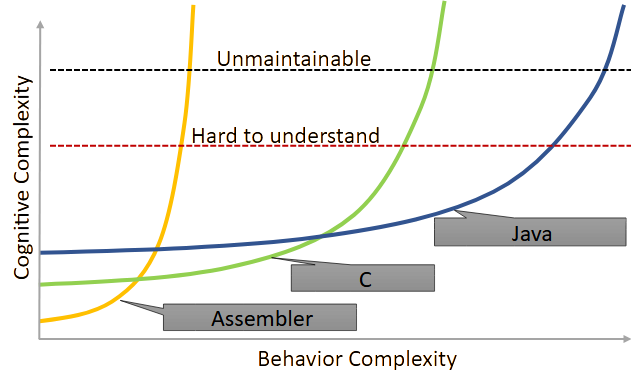

= Measuring Abstraction Level of Programming Languages
Konstantin Plotnikov <constantine.plotnikov@gmail.com>
:version-label: v0.1.0, 2025-08-02
:toc:
:toclevels: 3

(c) {author}, {version-label}

While languages are sometimes described as "high-level" or "low-level", such descriptions often lack both precision and direction. Sometimes such descriptions refer to closeness to hardware, and Rust is described as a low-level language. Or they could refer to abstraction level, and both Rust and {cpp} have a quite high abstraction level. Also, if we consider abstraction level, C is higher level than assembler, and lower level than {cpp}, so value range for level should have more levels than "high" and "low".

In this article, a theoretical framework that allows to measure an abstraction level of the programming language is presented. This framework allows not only to numerically measure existing languages, but also allows finding candidate core concepts for the languages that will have a higher abstraction level than Java, {cpp}, or Rust.

== Background

If we consider language levels, there are clear improvements in abstraction level between the following groups of the mainstream statically-typed languages:

1. *"Flat" Languages*: FORTRAN 66, BASIC (unstructured), Assembler (non-macro), Machine Code. These languages have global namespaces, indexed access to the memory, etc.

2. *Structured Programming*: C, Pascal, FORTRAN 77. These languages implement structured programming approach and use blocks, procedures, data structures, hierarchies, and recursion to organize the code.

3. *Functional and Object-Oriented Programming*: {cpp}, Rust, Haskell, Java, C#, and FORTRAN 2003. These languages provide some mechanisms to work with partially known entities like generic, interfaces, classes, functions, closures, and so on. There are different opinions on what is higher level in discussions of FP vs. OOP.

Each new group introduces new types of constructs that allows for better scaling of the cognitive complexity of a program with the growth of the behavior complexity of the program. This allows creation of more complex applications.

If we try to introduce an absolute scale that measures language level, we would need an objective criteria that would sort languages approximately in this order. A naive approach is "likeness" criteria, using this approach we could intuitively classify language as belonging to some paradigm, and then assign numbers depending on the paradigm.

However, this approach does not help us with non-mainstream paradigms like Logic Programming, also within the Logic Programming paradigm there could be languages with apparently different abstraction levels (for example, Verse vs. Prolog). Thus, this approach could not be used to classify languages objectively. To classify languages objectively, we need a formal (or, at least, semiformal) criteria rather than intuitive.

It could be noted, that general-purpose programing languages describe state and behaviour of the program, and use different abstraction to combine pieces of description of state and behavior into more complex pieces. So reasonable approach to the language classification might be considering properties and available language elements and ways to combine these units together.

== Why to measure?

This is possibly the most critical question. The behavior complexity of program is usually growing over time. This is caused by changes in requirements, understanding of domain, bug fixes, external integrations, and other factors.

On other hand, the complexity of understanding the program is also changes in this process, and it is usually grows up with increased behavior complexity, usually only taking some minor reductions during major refactorings and or rewrites.

This cognitive complexity directly affects costs of fixing bugs, adding new features, or modifying old behavior. This is because after we have written some initial state of the program, after that we are modifying its behavior. To modify behavior, we need to perform the following steps:

1. Locate *all* relevant places that affect behavior that should be modified
2. Understand what changes in these places will produce desired changes in behavior without introducing undesired one
3. Implement these changes
4. Test the changes

The cost of steps 1 and 2 strongly depends on cognitive complexity of the program and with a growth of the program size, starts to occupy most the developer's time. For example, see https://news.ycombinator.com/item?id=18442941[the post about Oracle Database development process] that describes horrors of the working with a large code base.

However, in different programming languages, the cognitive complexity growth curve is different. In my intuition, the growth curve is like on the diagram below. I talked with different developers, and most of them have the similar intuition about this process.

There are the following important points about this diagram.

* The lower the level of the language, the lower entry cost for it. Elements of the assembler language are easiest to understand. There are just too much of them, particularly in the case of CISC ones. Java brings a lot of cognitive costs to the table ever for Hello World program if one wants to understand program completely.

* The growth of the behavior complexity causes a non-linear growth in the cognitive complexity of the program. So it becomes harder and harder to understand what is going on in the program. Eventually every program reaches unmaintainable level.

* The higher the level of the language, the slower the complexity growth. So we could implement more complex behavior in the program before it reaches the unmaintainable level.

The program is not necessary one application in the sense of operating system. A set of related microservices that are maintained by some team could be considered as a single program if there is a shared code and concepts.

So, a reliable measuring approach of the programming language level will allow us to make the following deductions:

* It would allow us to filter out technologies that provide fast start and fast growth of the complexity. Some low code solutions are just like this. There are a lot of nice small demos, and there are problems with technology is implemented on larger scale. I had personal experience with some of such technologies.

* It would allow us to understand which technologies are about the same in complexity grows, so instead of discussing the language we could consider other factors like libraries, platform support, integrations, or team experience. Complexity growth for C#, Go, Java is about the same, but if we need to implement some functionality instead of using some library, this functionality will add to complexity growth.

* It would allow us to predict if some technology is a breakthrough in complexity management area, or it just the same thing again, and only some minor improvements could be expected. There are a lot of technologies that are claiming to be a new generation, but after hype calms down, there are not so much difference from existing ones.

== Necessary Conditions for the Next Level

In the article https://homepage.cs.uiowa.edu/~jgmorrs/eecs762f19/papers/felleisen.pdf[On the Expressive Power of Programming Languages] by Matthias Felleisen, the author discusses the formal approach to what is syntax sugar and what is not.

[quote, On the Expressive Power of Programming Languages, Matthias Felleisen]
The essence of simple statements about "syntactic sugar" relationships is a set of three formal properties. First, the _expressing_ phrase is only constructed with facilities in a restricted sublanguage. Second, it is constructed without analysis of the subphrases of the _expressed_ phrase. Third, replacing the instances of an _expressed_ phrase in a program by the corresponding instances of the _expressing_ phrases has no effect on the behavior of terminating programs, but may transform a previously diverging program into a converging one. A formal framework of expressibility must account for these ideas with precise definitions.

John Shut develops this idea further in the article http://fexpr.blogspot.com/2013/12/abstractive-power.html[Abstractive Power]. He introduces Macro-abstractive and Macro-expressive relation between languages.

To sum it up, the next level should not be just a syntax sugar, so there should be some non-local program analysis is required when transforming constructs. If we translate higher-level constructs to lower-level constructs, even if higher-level abstractions are implemented in lower-level language, we could expect lack of native support for them. And there should be some additional transformation level in the form or non-local design patterns, interpreters, or compilers.

For example, window function in most of C-based UI toolkits has a user state pointer associated with window handle. The pointer is supplied during create operation and can be accessed later. This is basically implementation of function reference idea from FP using lower level means. However, the information about type of the state is lost, and it needs to be recovered when state is used. Information about type of the state is kept in the mind of the developer, and no trivial transformation to recover it is possible.

However, the presence of such non-trivial translation is necessary, but it is not a sufficient condition. When implementing internal or external domain-specific languages there might be also a need for non-local analysis of the code, but such DSLs often have simpler abstractions. For example, Java classes require non-local transformations to be expressible in Prolog, on other hand, Prolog rules require non-local transformations to be expressible in Java. So using this check it is not clear which language has a higher level.

== Classifying connections

If we consider the program, we need to make the following logical meta-layers.

1. Language
2. Program
3. Process

The program is an instance of the language, and process is instance of the program. Later in the article, I'll use the word 'concept' of entities of language level, and 'node' for entities of program layer. A node is obviously instance of some concept. Thus, concept is a type, and node is an instance.

For semiformal analysis of language in this article, we rarely need to go down to process level. However, there is an interesting consideration that nodes have data and behavior projection during program execution. The data projection is easy because they map to memory state (and CPU registers are special kind of memory). The behaviour projections are less obvious because they map to some actions in time (and ultimately to steps on CPU, but modern CPUs maps them even smaller behavior units). For example, C function maps both to the state (stack frame), and behavior (CPU steps after entering and before exiting the function). Note, assembler instruction is still a definition of behavior, execution of this instruction is an instance of this instruction.

In most languages, there are clear distinctions between layers, but Language-Oriented Programming makes 'concepts' and 'nodes' relative rather than absolute.

Concepts define how node could be connected to other nodes. The nodes in the program are connected to other nodes in many different ways. These connections could be classified into incoming and outgoing.

Incoming connection is when other node is using the current node. This aspect looks like interesting, but not critical for classification, because in reasonable language the concepts could be combined in many interesting ways and incoming connections looks like belonging to other entities.

Outgoing connections look like more interesting, because they belong to the concept itself. I'll base my language level scale basing on outgoing connection.

Connections also have meta and instance layer. Following UML, for connection definition, 'reference' and 'association' terms will be used, association will be used if 'reference' is occupied by some other meaning in the discussion context. For connection instance, the word 'link' will be used.

=== Connection Level 1. No outgoing connection

The first thing to note is that some concepts do not have outgoing references, and they are self-describing. For example, number literals have incoming references, but they do not reference any other entity directly.

This is more like a technical level, to align levels used in this article together.

=== Connection Level 2. Flat

The historically next type of connection is by a name or label in a flat global context. The data and code labels in an assembler language are examples of this. Visual languages often use arrows to connect concepts on the single picture. But there are a lot of other implementations of this type of connection:

* function names in C
* global variables and CPU registers
* constants
* type names C or Java
* line numbers and go to

Names do not have to be explicit. In the sequence, items are named by their position. Also name could be composite, for example in SQL there are names like `catalog.schema.table`. These are still global names like human names where is there a fist name, a last name, and other name components.

=== Connection Level 3. Structured

The biggest transition on this level is we refer not to leaf entities, but to some structured groups of entities. So names are resolved within some structured context of that group. On the level 2 we had a single global context for name interpretation, but names could have been composite. On the level 3, there could be multiple contexts with the same structure. Thus, we need to supply context to understand meaning of the reference.

The most common thing is a local variable, that is reference relative to context of the stack frame. For recursive function, there are multiple instances of memory cells described by local variable on the same call stack, but in different stack frames.

While function name in C is a global concept, the function call operator is a structured concept, because a function call assumes a caller stack frame and parameters are supplied at call site rather than put to some global variables or registers.

There are a lot of other implementations of the structured name:

* C struct fields (resolved in the context of struct instance)
* Recursive function calls (resolved in the context of the previous call frame)
* Field names in SQL table (resolved in the context of a record)
* Hierarchical block structure (block is a group of statements, and statements refer to other statements recursively)
* Pointers
* Arithmetic expressions

The key question to distinguish between global and contextual connections, is that name is resolved relatively to some structured entity, or it could be resolved from the global context. And could be different instance of the context theoretically used in this place.

For example, to access global variable, just a pointer to the memory cell is needed. For struct field, there is pointer to the start of struct is needed, and memory location is evaluated relatively to it. For local variable, pointer to stack frame is needed, and local variable is accessed relatively to the stack frame.

For example, the names like `schema.table` in SQL are not relative, because schema is a global name rather than variable. It is not possible to refer to tables in different schemas using common code, while staying in SQL language without code generation. Java package names also just global names, because it is not possible to have package as variable.

=== Connection Level 4. Formal

On this level, a referrer has only some partial knowledge about the referenced object. There are some formal criteria to which referenced object must match. This is different from no knowledge of structure in the flat level 2, or the full concrete knowledge in the structured level 3. For example, variable of interface type could refer to objects of different classes that implement this interface.

Basically, the client of the node interacts with some control panels of the black box. Different black boxes kinds could have the control panel of the same kind, and the black box could have multiple control panels. Examples of concepts that use this connection type:

* Interfaces and abstract classes
* Function references (in FP)
* Generics
* Virtual method calls

=== Connection Level summary

It is actually quite simple to determine to which level connection belong.

The level 1 connections actually never happen, so it is easiest to classify. This level is reserved for future use.

If to access referred value we just need some composite name, then it is the level 2 connection. Global variables are just that, to access a global variable we just need to know name.

On the level 3, the name is resolved relatively to some context, and it does not make sense without a context. For example, C struct fields are resolved relatively to struct pointer. Local variables and function parameters are resolved relatively to a stack frame. A quick check for this level is if name could designate multiple values at the same time depending on the context. For recursive function, there might multiple stack frames at the same time active, and local variables designate different memory locations depending on the frame.

On the level 4, the question is whether there are multiple but differently structured things could be used. For example, the variable of interface type could reference instances of different class with completely different structure. A virtual call might use different implementations that depend on the state of different structure.

Basically, if we consider levels, there are the following levels in accessing entities if we interpret it.

1. Value
2. Name -> Value
3. Context -> Name -> (Context|Value)
4. Context -> Name -> Mapping -> (Context|Value)

This for example reflects in specifying how things are addressed in the program:

1. There is no need to address things, because there is only one thing in the focus.

2. *Address* (or *Index*) is just integer that is interpreted up to instruction where it is used (for example in assembler, or index in array). At place where it is declared, there is no information on how it would be used.

3. *Pointer* has type, so we know what we are addressing, and pointer specifies structure of the specified entity.

4. *Reference* has (in general) only partial information about addressed entity specified as interface, some super class, generic type, or function type. The referrer does not need to care how this partial information is mapped, because reference know how to access complete knowledge (for example, using virtual table encoded in objects or using fat pointers). In languages with garbage collection, in-memory bit representation might change over time while referencing logically the same object.

As it could be seen, each new level adds a new step of indirection, making each step more abstract.

== Concepts and Reasoning Levels

After we consider the connection levels, it is possible to consider concept levels. The simplest way to do so is to assign the level of the highest level of possible outgoing connection type.

The program is basically a graph of concept encoded in textual or other form with some execution semantics. In the case of text, the concepts are linked to each other explicitly by name, or implicitly by a textual position. For example, `go to 10` statement refer to the line `10` by name. While in sequence of statements `t = a; a = b; b = t;` the statements implicitly refer to the next statement by position. The if-then-else statement in structured programing languages, also use by position reference to inner blocks and condition expression.

This reconstructed graph representation is used when programmers reason about the code. During reasoning, the focus of attention is moving along connected graph of nodes. The different kinds of nodes support different reasoning types about programs.

=== Level 1. Single concepts

If the concept does not have any outgoing links, all conclusions about it are done locally. The simplest example of such concept is a value literal like `42`. We do not need to refer to anything else when coming to some conclusions about this node.

Such nodes are usually terminal nodes in the reasoning process, because when it is reached, we could not go anywhere, we could only examine node itself and bring reasoning results back when we are returning to the previous reasoning step.

The logic on this level is something like reflex-response. We interact with item and it changes.

=== Level 2. Flat concepts, storytelling and transduction reasoning

The flat level provides concepts that are located on the single global level. And they refer to each other by global name. Sometimes name is composite (like global array and index in it). Let's consider samples in two flat languages: BASIC (unstructured) and Assembler.

Let's consider a random sample from web for assembler (https://www.tutorialspoint.com/assembly_programming/assembly_logical_instructions.htm[taken from tutorialspoint.com])

[source]
----
section .text
   global _start            ;must be declared for using gcc

_start:                     ;tell linker entry point
   mov   ax,   8h           ;getting 8 in the ax
   and   ax, 1              ;and ax with 1
   jz    evnn
   mov   eax, 4             ;system call number (sys_write)
   mov   ebx, 1             ;file descriptor (stdout)
   mov   ecx, odd_msg       ;message to write
   mov   edx, len2          ;length of message
   int   0x80               ;call kernel
   jmp   outprog

evnn:

   mov   ah,  09h
   mov   eax, 4             ;system call number (sys_write)
   mov   ebx, 1             ;file descriptor (stdout)
   mov   ecx, even_msg      ;message to write
   mov   edx, len1          ;length of message
   int   0x80               ;call kernel

outprog:

   mov   eax,1              ;system call number (sys_exit)
   int   0x80               ;call kernel

section   .data
even_msg  db  'Even Number!' ;message showing even number
len1  equ  $ - even_msg

odd_msg db  'Odd Number!'    ;message showing odd number
len2  equ  $ - odd_msg
----

The program prints lines "Odd Number!" or "Even Number!" depending on what number is specified in the instruction `mov   ax,   8h` just after the label `_start`. Each instruction here uses either constants or global variables (the level 2), literal values (the level 1), or constants (the level 2). Registers like `eax` or `ebx` are essentially global variables. Labels like `_start`, `even_msg`, or `outprog` are constants. Some instructions use implicit registers like `jz    evnn` instruction uses 'last operation flags' remaining after `and   ax, 1` instructions, but these implicit registers are still global variables.

NOTE: The sample is copied from source "as is".

Let's consider a simple BASIC program that calculates 20th prime number:

[source]
----
100 DIM P(20)
110 N = 0
120 C = 2
130 FOR I=1 TO N STEP 1
150 D = C / P(I)
160 IF INT(D) = D THEN 200
170 NEXT I
180 N = N + 1
190 P(N) = C
200 C = C + 1
210 IF N < 20 THEN 130
220 PRINT "20th prime = ";P(20)
----

First thing to note, that each line is an independent global entity. The line refers to the next line by position, but there are also references by a line number in conditional operators, and there are also references by variable name in the `170 NEXT I` statement. However, there are also islands of the level 3 concepts in the forms of the expressions like `C / P(I)`, however these islands belongs to a single statement, so reasoning about these expressions is limited to the single statement.

To understand what is the state of the program at the line 150, we need to consider all possible paths that leads to it. In this simple program there are two ways to reach this string. Generally, all possible execution paths needs to be checked if the line is executable at all. So reasoning process is tracing all possible paths in the concept graph, because all nodes are on the top level, the navigation is need to go from start and continue going while updating state on each step. The reasoning flow is like storytelling. This observation is not new. The limitation of such reasoning process is described in the article https://www.cs.utexas.edu/~EWD/transcriptions/EWD02xx/EWD215.html[Go To Considered Harmful].

[quote, Edsger Dijkstra,Go To Considered Harmful]
The unbridled use of the *go to* statement has as an immediate consequence that it becomes terribly hard to find a meaningful set of coordinates in which to describe the process progress. Usually, people take into account as well the values of some well chosen variables, but this is out of the question because it is relative to the progress that the meaning of these values is to be understood! With the *go to* statement one can, of course, still describe the progress uniquely by a counter counting the number of actions performed since program start (viz. a kind of normalized clock). The difficulty is that such a coordinate, although unique, is utterly unhelpful: in such a coordinate system it becomes an extremely complicated affair to define all those points of progress where, say, n equals the number of persons in the room minus one!

[NOTE]
====
There are actually useful categories of technologies that supports storytelling-style reasoning about the program behaviour:

* For the present tense stories, there are debuggers that allow immersive navigation through the story of the program execution and review actual program state in the process.
* For the past tense, there is logging that allows to review the past story of program execution.
* For the future tense, TDD advocates writing story in the form of a test case first, and making the story (described in the test case) true later.
* The sequence diagram is another way to specify a specific interaction scenario, and it is basically story told in pictures.
* If we take wider contexts, in BA context terms "User Story" and "Epic" directly refer to storytelling style reasoning.

However, these technologies supports reasoning about specific traces of program execution. So, they could not be reliably used for reasoning about all paths program execution. It is well known that unit tests could help to detect bugs, but they could not help prove there are not bugs (in general case).

To do reasoning about other path before program execution we need to execute program in the mind, and the mind is much slower and more error-prone than computers for the task of program execution (also see https://en.wikipedia.org/wiki/Computer_(occupation)[Computer (occupation)]).
====

Since we have a single flat graph, when changing the program behavior we can only add, remove, or replace some nodes in the graph individually. In case of BASIC, we need to add, remove, or update lines. The storytelling-style reasoning require us to walk all possible paths in the program, and this is very expensive. And there is a cheaper method of guessing change effect for the program, we could guess that program will behave in the way similar to previous, except for effects changed lines. This is reasoning by analogy or transduction. This way is much less stable than storytelling, and it could easily lead to errors.

=== Level 3. Structured concepts, first-order logic

Structured links add additional element to the name interpretation - a context. One of the simplest things is a local variable. To understand what it could contain, we need to understand the current stack frame. In the case of recursive call, the variable value could be different for different stack frames. Let's consider a simple recursive factorial function in C:

[source,c]
----
int factorial(int n) {
    if (n <= 1) {
        return 1;
    } else {
        return factorial(n - 1) * n;
    }
}
----

Also, conditional statement uses relative links to its components. The conditional statement does not refer to the statements by absolute names like labels or line numbers. The statements are organized in blocks, and `if`, and the conditional statement composes these blocks into new whole. There could be nested `if` statements. The same is for expressions, expressions form a tree.

This hierarchical composition gives us a new way to reason about the program. We could attach inferences to nodes in the tree. So, during reasoning, preconditions are pushed from previous and outer nodes in the text, and post-conditions are pushed to outer and next nodes.

For example, in the previous factorial sample, we could easily infer that in absence of integer overflow, the value is always positive:

1. By induction on natural numbers, if predicate is true for `0` and if truth of predicate for `n - 1` implies truth for `n`, then it is true for all natural numbers.
2. For values less than `0` the value is `1` (that is a positive integer).
3. So it is true for `0` and `1` (because of `return 1`)
4. If `factorial(n - 1)` is positive, then `n * factorial(n - 1)` is also positive (because it is multiplication of positive numbers), and `n` is positive here because `0` and negative numbers are handled by other branch of `if`.
5. The statement `if` always returns positive numbers, because all branches return a positive number.
6. The function factorial is always positive, because its value is value of 'if' statement that is always positive after applying induction principle.

This way of inference is different from the storytelling way, because length of reasoning is limited by number of lines and depth in the code. Storytelling is limited by number of executed operations, and it might even never to complete. These structured concepts allow reasoning using first-order logic about the program. Induction by execution path is much longer than induction by a program code tree. However, the entry barrier for such induction is much higher. One has to understand and use relevant induction principles to reason about the program behavior.

However, https://www.cs.utexas.edu/~EWD/transcriptions/EWD02xx/EWD249/EWD249.html[the program needs to be constructed in the way that allows such reasoning].
[quote, Notes on Structured Programming, Edsger W. Dijkstra]
Eventually, one of our aims is to make such well-structured programs that the intellectual effort (measured in some loose sense) needed to understand them is proportional to program length (measured in some equally loose sense). In particular we have to guard against an exploding appeal to enumerative reasoning, a task that forces upon us some application of the old adage “Divide and Rule”, and that is the reason why we propose the step-wise decompositions of the computations.

So, structured concepts enable constructing programs that allow new type of reasoning, rather than automatically grant such ability. For example, clever using of `go to` (or equivalents) might lead to disabling structured reasoning about the program, and that has lead to the https://homepages.inf.ed.ac.uk/rni/papers/realprg.html[quote]:

[quote, Real Programmers Don't Use PASCAL, Ed Post]
Besides, the determined Real Programmer can write FORTRAN programs in any language.

[#formal_concept]
=== Level 4. Formal concepts, higher-order logic

In the level 4, the concepts references could be annotated with some formal criteria for the referred object. Generally structure of referred object is not known. This is different from the level 3 concepts. On the first sight, it is a downgrade that the referrer only know partial information about referenced entity, but on other hand referrer does not care about difference in concrete information about possible referenced entities while they match the formal criteria.

For example, in C, if macros are not used, we need to write the following functions for max:

[source,c]
----
int max_int(int a, int b) {return a < b ? b : a; }
long max_long(long a, long b) {return a < b ? b : a; }
char* max_str(char* a, char* b) {return strcmp(a, b) < 0 ? b : a; }
----

In Java, we could write max only once:
[source, Java]
----
public static <T extends Comparable<T>> T max(T a, T b) {
    return a.compareTo(b) < 0 ? b : a;
}
----

This is because Java's version does not care about what the type exactly is. It only cares about its implementation. So, knowing less frees our reasoning about the program from unneeded details, and it also makes our code more widely applicable.

The difference from the level 3 reasoning is that the reasoning is split into two parts, up to some formal criteria for referrer, and from formal criteria for referred.

Let's compare a simple example where value is some variant between float, double, or int.

In C it would be the following:
[source, c]
----
enum tag_type {I, D, F};
union content_type {
    int i;
    double d;
    float f;
};

struct tagged_type {
    tag_type tag;
    content_type content;
};

void log(tagged_type* t) {
    switch(t -> tag) {
        case I: printf("%d\n", t->content.i); break;
        case D: printf("%lf\n", t->content.d); break;
        case F: printf("%f\n", t->content.f); break;
        default: printf("ops!!!\n");
    }
}
----

In Java, it would be the following:

[source,java]
----
interface Printable {
    String toText();
}
class I implements Printable {
    public I(int i) {this.i = i;}
    int i;
    public String toText() {return String.valueOf(i);}
}
class D implements Printable {
    public D(double d) {this.d = d;}
    int d;
    public String toText() {return String.valueOf(d);}
}
class F implements Printable {
    public F(double f) {this.f = f;}
    int f;
    public String toText() {return String.valueOf(f);}
}
void log(Printable p) {
    System.out.println(p.toText());
}
----

In C, the reasoning cost about union is `O( (amount of referrers) * (amount of referred cases))`, because we need to consider all cases in all places where we need specific values. In Java, the reasoning code is `O( ( (amount of referrers) + (amount of referred cases) ) * (used contract size) )`, because we need to reason for referrer up to interface, and for referrer from interface. With code changes, it is the same. If we need to add a case to union, in C we potentially need to visit all sites where union is used. For Java, we need to just add class and implement all methods in the interface, and the catch is that if interface is violating Single Responsibility Principle, the cost might a quite high.

NOTE: Functional Programming makes single method objects very convenient to use. The single method object is the second-simplest contract possible. And the big portion of the power of Functional Programming is derived from the fact that in formula `O( ( (amount of referrers) + (amount of referred cases) ) * (used contract size) )` the component `(used contract size)` is very small.

This happens because we include a type into reasoning steps. Considering that https://en.wikipedia.org/wiki/Curry%E2%80%93Howard_correspondence[a type corresponds to a formula] in the logic, and we use formula as parameter to another formula, this promotes our reasoning logic to the higher-order logic.

Generally, cases of interfaces or function types in functional languages, represents concept of existential quantification over predicates in the logic. For example, let's compare function pointers and function references. Let's use the following:

* `a -> b` -- function pointer type
* `a => b` -- function reference type

The type equivalence could be defined as the following:
[code]
----
A => B = exists T, ((T x A) -> B) x T
----

Then invocation will look like the following:

[code]
----
appy_ref f : (A => B) a : A = let =
    open f as t with
        apply_ptr (first t) (pair (second t) a)
----

So the idea is that reference assumes only the partial knowledge about the referring entity, and this is represented by the existential type in the equation. See paper 'https://www.cs.cmu.edu/~rwh/papers/closures/popl96.pdf[Typed Closure Conversion by Yasuhiko Minamide, Greg Morrisett, and Robert Harper]' for more details. This could be obviously extended to the case of interfaces and classes.

Generics represents "forall" types, the example with `max` above uses generics, and this allows us to cut the cost of reasoning by proving things only once, without repeating it for every concrete type.

To sum  it up, on the level 4, the reasoning cost has improved further. On the level 3, we are able to reason by induction by source tree. On the level 4, we do not need to reason on the entire tree, we can split reasoning process up to some checkpoints, where some formal criteria are specified. The key to the reasoning process is in selecting such suitable formal criteria (interfaces, generics, so on). Choosing the wrong criteria might increase cost of reasoning instead.

==== SOLID Principles

Let's check principles of https://en.wikipedia.org/wiki/SOLID[SOLID] from this point of view.

===== Single responsibility principle

[quote]
There should never be more than one reason for a class to change.

This principle states that class should be responsible for one thing. If there are multiple things the class is responsible for, then when reasoning about the class behavior we need to consider interactions of these things. For example, when changing some behavior, whe need to consider all responsibilities of the class. Thus, we have multiplicative cost of change in the worst case.

===== Open–closed principle

[quote]
Software entities ... should be open for extension, but closed for modification.

This is about boundaries in the components. For good OO design, we need to consider components as black boxes, so interact with them using formal criteria formulated at the boundary. Modification is about crossing this boundary, and doing things beyond formal criteria.

===== Liskov substitution principle

[quote]
Functions that use pointers or references to base classes must be able to use objects of derived classes without knowing it.

This is obvious. Components that depend on the contract should just use that contract and not care how this contract is implemented. If we start to care who implements contract, we convert additive cost of reasoning back to multiplicative cost.

===== Interface segregation principle

[quote]
Clients should not be forced to depend upon interfaces that they do not use.

This is also interesting. When defining contract boundaries, the contract size increases cost of reasoning for both client and service. Client knows about things that it does not care about, so when reasoning change we at least need to view them to understand whether they are relevant. The service needs to implement things, that some client need and other do not need, so it will be a tax on implementing component later.

===== Dependency inversion principle

[quote]
The Dependency inversion principle (DIP) states to depend upon abstractions, not concretes.

The more abstract contract is, the more flexibility in implementation of the contract we have.

===== Cost of SOLID

The thing that is missed in the SOLID is that contract itself has the cost: it needs to be formulated, maintained, and distributed. Also, components could not rely on things that are not in the contract. For widely distributed library, the design should be very careful with respect to SOLID, but for private microservice code we could cut corners, to make development cheaper and refactor it later when needed. The total cost of contract depends on uses and implementations, if there is a single supplier of the interface and a single producer, the cost of having separate interface might be too high.

This is why many OOP languages eventually implement some form of sum and product types that are basically the level 3 type constructs. This allows to have small level 3 islands where local reasoning simpler due to the small size and lower abstraction level, while still having overall the level 4 reasoning for the program, that allows us not to think about details of these islands.

== Language levels

=== Evaluating mainstream language

The classification of the languages is more difficult than classification of concepts. The language naturally contains concept from the level 1 up to some other level. For example, BASIC (unstructured) control flow is the level 2, and expressions are clearly the level 3.

If we consider cognitive scalability, we need to understand which concepts are on the *growth path* when we try to increase behaviour complexity. Concepts on growth path are linked to each other and should grow when behavior complexity grows:

|===
| Language | Paradigm | Growth Path Concepts

| BASIC (unstructured) | Flat | lines and global variables
| Assembler | Flat | Instructions and labels
| C | Structured | Functions, structs, blocks, expressions
| Java | OOFP | Interfaces, Classes, Methods
| Haskell, OCalm | FOOP | Functions, Type Classes, Data Types
|===

Concepts on the growth path are important, because they directly affect how we are reason about the program. With each added node, it is more complex to understand and modify code. And the way the nodes are connected shapes possible reasoning about the code.

The naive classification could be based on the max level of the concept in the language. However, such classification could be a problem. Let's consider line-based BASIC language (also applicable to FORTRAN 66).

The expression language is the level 3, but it does not help with cognitive scaling, because top-level statement language is of the level 2, and these the expressions are just the level 3 islands in the sea of the level 2 see of statements. However, to grow the behavior complexity, we need to increase the amount of element in the sea, the size of individual islands stays the same.

This example shows, that we need to consider links on the growth path, rather than all links of the concept. So we need to measure the level of the sea, rather than the level of the islands.

[cols="1,3,5,10,5"]
|===
| Level | Paradigm | Example Language | Top-level concepts | Reasoning

| 2 | Flat
| BASIC (line-based), Assembler
| global variables and arrays (2), statements
| Storytelling, Transduction

| 3 | Structured
| C, Pascal
| Structs, functions/procedures, blocks, expressions
| First-order logic

| 4 | OOP and FP
| Java, {cpp}, C#, Haskell
| Interfaces, classes, generics
| Higher-order logic
|===

=== The level 1 language

The classification suggests that there should be some degenerate case of programming languages of the level 1 that is centered around a single value that does not have outgoing connection.

Such language should still control a computing system.

Such language could not have a sequence of steps, because sequence of steps is already the level 2 concept. So organization of steps should be done by a programmer in his/her mind, and system with the level 1 language should just change the state when steps are executed by an operator.

And there is a language that seems to conform to it. It is the language of the simple non-programmable calculator. Each key press modifies the state of calculator. But user still works with a single value on the screen. There are hidden registers for binary operators, but it is possible to see only a single value on the screen and work with only a single value.

I'll call this paradigm 'calculator', and it is here mostly for completeness.

=== Non-mainstream paradigms and DSLs

Let's consider Prolog as example (the specifically version ISO/IEC 13211-1:1995, as other versions of Prolog might add or remove features).

The prolog data type is term that have functor (just a string with some equality check optimizations) and arguments. The term type is functor and arity. There is no existential types like interfaces, so predicates are referred by stateless pair of function and arity. The code part is predicates, that support recursion, but they could be referred to only as function pointers rather than function references.

So Prolog is a level 3 language.

Prolog was promoted as a general purpose language and replacement for the mainstream languages of that time. This did not work for a number of reasons. I think that primary reason was that as the level 3 language, it did not provided expected productivity boost because its cognitive scalability curve was about the same as the curve structured programming languages like C or Pascal. Even a bit worse because it was a dynamically-typed language (see more later at <<dynamic-typing>>). And the task of finding solutions over finite domains does not happen that often in practice to offset usability and performance problems added in other areas. So Prolog is more like a side story of programming language evolution rather than a continuation of the main line of general purpose programming languages.

NOTE: One of the current attempt at logic programming is https://en.wikipedia.org/wiki/Verse_(programming_language)[Verse]. It looks like a leve 4 language, and it is unlikely that this language will produce a significant productivity boost comparing with a good level 4 languages like Kotlin. I lack domain experience to understand if it is good for niche uses like gamedev, but I do not see why I would want to switch to it from Java for modern enterprise applications.

== Future languages levels

The good scale should not only describe the past, but also be able to do reasonable guesses about the future. So, let's consider what would be a level 5 language.

=== Past level transitions

To understand transition between levels, let's consider transition between levels in the past. There were 4 level working transitions in the past:

==== Level 1

Invention of mechanical calculator is transition from mind and paper calculations to a level 1 computing system. I think the first working solution is by Blaise Pascal in 1642, but there are some discussions on this topic. Generally, during this transition some mechanical operations are offloaded from mind to device. This pattern of offloading operations to the device will be seen further.

==== Level 2

The level 1 to level 2 transitions is more vague, there are different degrees of programmable calculations, so it is more to the point where we could draw the line. I think a good cutoff line is ENIAC in 1945 that seems to be the first working general purpose computer. The theory was developed long before that by Alan Turing, Charles Babbage, and others. The difference of this level is that now the sequence of operation is moved from mind of operator to the device.

The level 2 languages include the most elements of the level 2 language, and add new structure over them (sequences of operations and sequences of data).

==== Level 3

The transition from level 2 to level 3 is somewhat vague, and ALGOL 58 and ALGOL 60 are first languages in that generation. However, Pascal and C are probably more widely known, and C is still very popular language for system programming. The reasoning behind transition is documented in Edsger Dijkstra's letter "Go To Statement Considered Harmful", published in the March 1968. The good analysis of the article from modern perspective is done by David R. Tribble in the article http://david.tribble.com/text/goto.html[Goto Statement Considered Harmful: A Retrospective].

The core idea is that we now more think about the program along execution path, but we could think about the program along its tree structure. The length of reasoning is proportional to the code size rather than to execution time. It is possible to reason about flat program structurally, by making conclusions about linear or cyclic chains of operations. However, in the level 3 languages is no more need to mentally mark connected chain of nodes as loop with conditions, the loop is explicitly written in the code. Thus, it is possible to reason about it using first order logic.

Interesting thing is that at some time, flowcharts (the level 2) has gone out fashion as descriptions of algorithms. Textbooks and specifications just silently switched to pseudocode (mostly, the level 3). And the new description format is easier to understand if one learns it.

The level 3 replaced addresses with pointers, so now address has type information attached, and it is known how to interpret it. Structures allows to address a set of fields as whole, this is different from the level 2 languages, where fields are addressed individually. The executable code could be also addressed as whole, for example function pointer points to the whole function of some signature, not some arbitrary piece of the code. So it address a group of statements. Control flow statements also address their content as a group.

So the level 3 languages add new structures that organize statements and global variables into new whole as well.

==== Level 4

The transition from the level 3 to the level 4 is more puzzling. OOP itself was first implemented a long ago, starting with https://en.wikipedia.org/wiki/Simula[Simula] (1962). FP has long history as well starting with https://en.wikipedia.org/wiki/Lisp_(programming_language)[Lisp] (1960). However, {cpp} was probably the first truly mainstream OOP language. For statical-typed languages, Java, C# and Go are current mainstream OOP languages in addition to {cpp}. For dynamically-typed, JavaScript and Python are top contenders, but python has found a big nice, and JavaScript is because of browsers.

The level 4 is implementation of https://en.wikipedia.org/wiki/Higher-order_logic[higher-order logic], that adds quantification over predicates (types). That corresponds to quantification over types in a programming languages. The core features of the level 4 are 'existential' and 'forall' types.

The existential quantification corresponds to function types, interfaces, and abstract classes. There is an implicit exists operator as it was discussed in the section <<formal_concept>>.

The universal quantification corresponds to generic types. Most of the level 4 statically-typed languages support generics. However, for some reason, popular languages like {cpp}, C#, Go, and Java started without generics in the first versions. Generics were added to them at some later versions. This caused inconsistencies and duplications in standard libraries. {cpp} case is understandable, because it was one of the first widely used OOP languages. For others, reason skipping generics is harder to understand. There seems to be logical inevitability of adding generics, because `forall` quantification is really important for reasoning in higher-order logic.

While FP and OOP belong to the level 4, there were a number of code generator, marcos, and design patterns that supported it in the level 3 languages. For example, the most of C-based UI toolkits implement something poor-man lambdas using function pointer with void pointer to implement handling of events for windows. https://en.wikipedia.org/wiki/IBM_System_Object_Model[IBM SOM] and https://en.wikipedia.org/wiki/Common_Object_Request_Broker_Architecture[CORBA] code generators generated C code that implements and invokes interfaces. {cpp} actually started as https://en.wikipedia.org/wiki/Cfront[external DSL that compiled to C code]. Unix file handles and everything-is-a-file are actually example of interface concept implemented as a design pattern. For more examples, see https://www.cs.rit.edu/~ats/books/ooc.pdf[Object-Oriented Programming With ANSI-C] by Axel-Tobias Schreiner.

For the level 4 languages, we see that they generally use level 3 constructs and add new organizing concepts over them. An object and function reference from FP is a new concept build over structs and functions. Comparing with structured languages, more things are offloaded to the code.

==== Primary Evolution Vector

Concepts of the previous level are used as building blocks of the next levels, but there are higher-level building blocks as well, that organize lower-level building blocks in non-trivial way.

New concepts provide a new way of reasoning of the program along of new connection types.

The new concept types provide new reasoning pathways along with new kinds of concept connections. This is directly reflected in the code. These new types pathways are more expensive to navigate, but it is more clear for higher-level whether we need to navigate them at all, or not for the current reasoning step.

This allows us to restrict reasoning scope, when we are locating pieces that affect specific behavior, or trying to predict effect of the change. So each new abstraction level on primary evolution vector greatly reduces software development and maintenance costs for idiomatic programs.

==== Common Evolution Pattern

New level of the programming language adds new constructs and integrate and organize in non-trivial way what was top-level constructs on the previous level.

There are some common things during transitions:

* On the new level the one or more concept are added that organize concepts on the previous level in a non-trivial way. A new kind of type will appear.

* Concepts of the previous levels are often restricted, so there are additional conditions on when they could appear. For example, `GO TO` should follow some block structure. Or typed references could not point to arbitrary object in statically-typed languages.

* The concept of the next level are actually used in the languages of the previous level, but they are natively supported. And developers use design patterns, whitespaces, comments, code generators, macros, or other means to support them.

* These concepts start to be used, because they really help to fight complexity. So, more the complex domain is, them more likely that concepts will appear. And using these concepts on the previous level is considered as example of a good design.

* These concepts are general-purpose, so they are applied independently of the domain.

* The next level language support these concepts directly, making their usage simple and direct.

==== Candidate concept for the next level

So, we need to detect some concept in OOP or FP programs that is domain-independent, more likely to be used if application grow, used to fight complexity, and it is hard to implement in OOP directly (requires some code generators, interpreters, macros, internal or external DSLs, design patterns, or other things). And these concepts should somehow organize classes, interfaces, and methods and introduce new kind of type.

Initially, when I started this analysis, I hoped that Language-Oriented Programming is the next big thing. So, the creativity of the software developers will be unleashed in the area of designing the languages. However, LOP does not directly match criteria above. After further research, I have found a single candidate that match all these criteria, and this candidate has greatly surprised me.

This is because the answer was "dependency injection".

* [*] On the new level the one or more concept are added that organize concepts on the previous level in a non-trivial way. A new kind of type will appear.
** Dependency injection frameworks directly or indirectly introduce concept of system that is composed of objects. System definition, uses classes to specify a system.
** System definition is a type, created system is an instance of this type. The system definition in Spring Framework consists of annotations, Java DSL for configuration, xml files, etc. The created system is an instance of some ApplicationContext subclass.

* [*] The concept of the next level are actually used in the languages of the previous level, but they are natively supported. And developers use design patterns, whitespaces, comments, code generators, macros, or other means to support them.
** Many OOP languages have some DI frameworks, but most of them require some kind of compiler (for example, Dagger 2) or interpreter (for example, Spring Framework) to work. These compilers and interpreters perform non-trivial analysis of the code to make things to work, and they require additional support from IDE to check things.

* [*] These concepts start to be used, because they really help to fight complexity. So, more the complex domain is, them more likely that concepts will appear. And using these concepts on the previous level is considered as example of a good design.
** DI is used to fight complexity.

* [*] These concepts are general-purpose, so they are applied independently of the domain.
** The dependency injection is used independently of the domain. The key factor is complexity of the application.

* [ ] The next level language support these concepts directly, making their usage simple and direct.
** I think that we do not have such language now.

So, a new level of programming languages will support a system as a new building block.

I see two possible names for the new paradigm:

* System-oriented programming
** Systems are central focus of new paradigm, but this name is confusing with https://en.wikipedia.org/wiki/Systems_programming[system programming].
* Holon-oriented programming
** Systems are components to other system, and to express this duality Arthur Koestler has invented the concept of https://en.wikipedia.org/wiki/Holon_(philosophy)[holon]. This variant looks preferable for now.

[NOTE]
====
There are some usages of the word "holon" in IT, but they are mostly unrelated or obsolete:

* There was the concept of https://github.com/holon-scribe/holon-programming/blob/main/README.md[Holon Programming] introduced by Pierre-Arnoul de Marneffe in 1973, but it did not stick, and it is hard to find even in history books.

* The concept of holons is https://arxiv.org/html/2410.17784v1[already used on macro architecture level] in IT. So this is using this concept in micro architecture level.

* There is https://holon-platform.com/platform/[Holon Platform for Java]. It is completely unrelated project.
====

=== New concepts

In holon/system-oriented programming new concept appear.

The *holon instance* is an object that contains linked objects with common managed lifecycle. So it is a system instance.

The *holon type* is a type of holon instance and provides rules for constructing holon instance, possible interactions with it. Basing on the level 4 experience, it looks like it might be a good idea to introduce a *holon trait* that is a purely abstract holon type like interface for Java.

In Spring Framework, the holon instance is ApplicationContext, a holon type is definition of system spread in annotations, xml files, java configurations. In Spring Framework, there are several "god"-holon definitions for each scope: singleton, request, session, etc. This causes multiple modularity problems.

The *aspect* is a mixin-like type that modifies behavior of type, method, or field. The support for AOP is one of key factors of Spring Framework popularity. And it looks like it is a necessary piece of puzzle. In Spring Framework aspects are untyped and interpreted/compiled. Still, they are an important way to split responsibility between system and component. They also help to glue pieces of functionality together. The aspect might be also a statically typed object.

[#l5-example]
=== Example of system/holon-oriented language

I'll use this concept, because I want to use composable systems, and the concept of holon expresses it perfectly. I'm currently working on prototype of a HOP/SOP language named L5.

In addition to holons, there is a need for interface like type for holons, and I will use trait as a name. There also need for reusable definition blocks for system definition, and this might be `aspect` that is a kind of mixin type for holons, classes, records, functions, and the most of the other language definitions.

A simple leaf DAO component might look like the following.

[source]
----
aspect TransactionAware for holon class {
    in TransactionManager;
}
aspect TransactionManadatory for fn with {
    in Trasaction;
    require instance TransactionManager;
    local invoke this.transactionManager.verify(transaction);
} as {
    // ...
}
holon class ClientDao with { @TransactionAware } as {
    in JdbcTemplate;
    fn published findById(id : UUID) : Optional[Client] with {
        @TransactionMandatory;
    } as {
        return jdbcTemplate.queryOptional(
            "select id, name from client where client_id = ?",
            array.of(id),
            {?rs; Client(rs.getObject(1, classOf[UUID]), rs.getString(2))}
        );
    };
};
----
The line `in JdbcTemplate;` is shortcut for `in val jdbcTemplate : JdbcTempalte`. However, 99% of names used in component for DI match name of type. So providing explicit name for dependency is an exception. `@TransactionAware` is aspect packages external dependencies and such aspect convert kind of converts dependency to component feature.

The module the provides multiple DAO components might look like the following:

[source]
----
holon class ClientDal with {
    @TransactionAware; // propagated to components
} as {
    in DataSource;
    // local component injected to componetns bellow
    local JdbcTemplate();
    // output components of module
    out lazy ClientDao();
    out lazy ClientContactDao();
    out lazy ClientAddressDao();
}
----

There could be also holon out-functions that allow implementing extension points.
[source]
----
/// some action manager for IDE Action
holon trait ActionManager {
    // facet is structured holon function type here is facet that takes
    // action context dependency as argument but provides action
    out fn action(name : String, action : facet { in ActionContext; out Action; } ) : ActionRegistration
}
aspect ActionProviderPlugin for holon class {
    in ActionManager;
    after ActionRegsitration;
    out List<ActionRegsitration>;
}
holon class MyEditPlugin with {
    @ActionProviderPlugin // aspect usage
} as {
    MyFileSupport(); // some local components
    // the action contributes to "out List<ActionRegsitration>"
    // <> - is a binary operator that specifies that the next block is holon-lambda
    // used as the last agument of function
    actionManager.action(#name "EditMyFile") <> {
        // this holon-lambda implments `facet { in ActionContext; out Action; }`
        // action that uses components from lexical scope,
        // it is lazily executed by action manager
        // in ActionContext is provided from facet type implicitly
        out EditMyFileAction();
    }
}
// "facet {  in ActionContext; out Action; }" is something like the following
// However, some form of genercis will be used for it
holon trait GenearatedFacetType {
    // out-function that return result and depends on ActionContext;
    out fn apply() : Result with {
        // because it is signature affecting, it is specified in "with" section
        in ActionContext;
    };
    // result holon type
    holon trait Result {
        out Action;
    }
}
----

See more examples in link:../02-holon-composition/HolonComposition.adoc[Report on Holon/System Composition Operations].

=== New Link Type and New Reasoning Type

There is a new link type adds environment as intermediate. When interacting between nodes, both refer to environment. One contributes to environment, other consumes from it. Environment generally could transform contribution, so consumed and contributed types could be different. If we consider links levels previously, a new link type is added:

1. Value
2. Name -> Value
3. Context -> Name -> (Context|Value)
4. Context -> Name -> Mapping -> (Context|Value)
5. Context -> Name <> Environment <> Mapping -> (Context|Value)

This also adds a new type of addressing:

1. Single
2. Address/Index
3. Pointer
4. Reference
5. Dependency

A new intermediate is added 'Environment' and links to this intermediate are bidirectional. This intermediate allows a new kind of reasoning. The component specifies expectations about environment, and environment implements them using components that contribute to the environment.

This allows a new type of reasoning. Instead of reasoning about references to other classes, we reasons about expectations of the components and whether environment satisfy these expectations. This is a new type of type check. The simplest check is the component with some interface is published on the environment. But these checks could be packaged together using aspects, and additional processing like interceptors, proxies, or lifecycle actions could be added to augment components in environment. On-demand component implementation basing on other components is also possible as demonstrated by Spring Framework and OSGi.

The transition from reference to dependency is somewhat subtle. However, it is another way to care less about things when reasoning, so we are again restricting reasoning scope like it was done on the previous levels. And because local reasoning scope is restricted, we could reason about much larger program, because there are fewer pieces for the code that just do not fit in our mind.

I guess there should be a new logic associated with this level, that allows constructing logic holons, and have additional inference rules about them. There might be something already happening on this level. Note, the dependency injection already leaking into tools, and Coq `auto` tactics is actually kind of automatic dependency injection along with other things. With development in this area we could expect development of formal tools that use environment/component separation. So we could see some post-higher-order logic, that would continue Curry-Howard Correspondence on the new level.

=== Deprecated Elements

New level also deprecates some elements or makes then unfashionable. Like `GO TO` was deprecated in structured languages.

I expect the following OOP elements to be deprecated:

Dynamic Scopes is a way to pass implicit arguments. Dynamic scopes is managing implicit environment that is bound to the stack. I think this will be deprecated in favor of lexical scoping and contextual argument injections. This will allow static type checking for the context. For example, it might be possible to statically check that method is called in the context of the transaction. Or produce a compile error if method is called where transaction context is available. I expect that dynamic scopes will remain in transitional languages, but it will be eliminated in new languages.

Reflection is used to implement "structure interpreters". The system-oriented approach combined with statically-typed aspects might help to avoid it for the level 4 concepts. For example, JSON parsing requires access to setters and getters, but with help of aspects it is possible create a static registry of object properties and use it during serialization and deserialization. Reflection will likely stay to support dynamic loading scenarios and some the level 5 metaprogramming, but it will likely become optional and new statically-typed languages will be AOT-compatible.

=== Compilation Process and Component linking

I think that during compilation process there will be at least one intermediate code for each logical level.

* The level 5 intermediate code that might be just enriched AST that is used for semantic checks,
* OOP intermediate code that translates components to objects while applying all aspects
* structured intermediate code for dataflow and control flow analysis that might have virtual calls inlined
* and finally LLVM, MLIR, WASM, or some alternative for generating final machine code.

The experience shows that good linking could happen only on the level of the language. For {cpp} it took a lot of time to create ABI. If we try to link on the lower level concepts, different issues will occur and some link-time optimizations will not be possible. Aspects will make this particularly acute.

So, I think we should give up on packaging code in standard OS shared libraries and just distribute some form of the level 5 intermediate code (like Java or .NET), or even just source as in the case of Go. The machine code could be created by AOT and linkers, or by JIT compilers. Some restricted platforms like game consoles require AOT compilation for all code, so such scenario should be considered in the compilation process design. OS-specific shared libraries could be a compilation target and used as deployment format, but making them development time format might be problematic.

=== Optimization Consideration

The level 5 constructs will be slow in the few first iterations of the languages. It will be faster than dynamically-typed and interpreted Spring Framework, but certainly slower than well-written plain OOP code at the first attempts to implement some language. The discovery of possible optimizations and designing languages to make such optimizations possible will take some time, and as result we could get even faster code later. Like, {cpp} compilers produce faster code than it is realistically possible in C when using OOP DSLs due to code complexity issues.

=== Summary of the Level 5

I think the following will be key features of the new level 5 language.

* New type that represents system/holon definition that consists of component definitions (classes + configuration + links). This might be something separate from the level 4 classes, or the same keyword `class` will be used, but concept will be lifted to new level (like `struct` in {cpp}).
* Rich set of composition operations over system/holons
* Aspect or mixins to manage and reuse connections between components and systems
* Dependency injection to automate linking with holons
* Deprecation or elimination of static variables and static resource access. While it was advocated within OOP for the long time, OOP did not provide needed abstractions to support it.
* Deprecation or elimination of dynamic scopes (like `ThreadLocal` or `ScopedValue` in Java). Aspects and DI should provide adequate replacement using lexical scopes.
* Large portion of the level 4 meta-programming where reflection is currently used will be replaced with aspects. There might be a need for reflection for the level 5 operations.
* The standard library will be likely highly-modular with absolute minimum in the core, and even basic IO operations like file system access will be in the optional modules that will be injected if needed.

== Summary of Measuring Procedure

The first step in the measuring the level of the language is selecting concepts that are on the critical complexity path. Such concepts form the top level of the language. The number of such abstractions increase in number with grows of the complexity, and they are not limited or contained by other abstraction.

The second step is identifying concept links that are not the growth path.

The third step is measuring level of the links and their appearance in the idiomatic programs.

For example, the statements are abstractions on the growth path for unstructured BASIC and FORTRAN 66, because the program usually grows by adding global statements. However, for Visual BASIC and FORTRAN 77, statements are mostly contained in procedures and functions, so whey reasoning about the program we could analyze the entire procedure and save assertions about it, ignoring statement content after reaching to the conclusion.

=== Issues with measuring procedure

There are kinds of trivial containment that does not add structure over contained elements. For example, formally, Java packages contain classes and interfaces. However, the packages are just name prefixes for Java class names, so a composite name could be formed. There still a global flat namespace for classes, and we still reason about individual classes, packages are trivial groups of classes, not providing useful operations over them. Some libraries like Spring Framework allow some package-wide operations, but this is done by interpreters of system definition language that use Java as a substrate language.

The step of identifying concepts on the growth path is semiformal and has subjective elements.

* Idiomatic programs needs to be considered, because "the determined Real Programmer can write FORTRAN programs in any language". It is also possible to write procedural code in OOP languages. The step of selecting idiomatic program is somewhat subjective. The understanding of good OOP stabilized only recently, and there are still disagreements on details or applicability of the principles.

* The reasoning analysis step requires introspection and observation.

* The high level concepts could be used to infer meta-structure of program, and it is possible to confuse mental concepts and DSL elements with language features. For example, it is possible to do OOP and FP in C, but C itself does not support it. So a clear distinction must be made if this is a language concept, or this is a concept that expressed using language as internal DSL substrate. For example, Java annotation processing is supported by java compiler to implement a rich DSLs, including dependency injection frameworks. But these are concept built using Java as DSL substrate, not native Java concepts.

After that, we need to examine how concepts on the growth path are connected to each other and what is the level of connections on this growth path. The maximum level of connections on the growth path determines the level of the language. For example in BASIC, The 'LET' statement has expression as its part (the level 3) and has link to the next statement (the level 2). However, the expression is not on the growth path, but link to the next statement is. So while the concept is the level 3, on the growth path it behaves as the level 2.

However, it might happen that there is a mix of different levels on the growth paths. If lower level concepts dominate, we could mark the language as intermediate between levels, or just ignore rarely used high-level concepts. For example, formally FORTRAN 66 had procedures, but their implementation were plagued with limitations, and they were rarely used in idiomatic code. When creating a teaching language BASIC at that time, the authors of BASIC even dropped procedures as non-essential element, instead there were `GO SUB` and `RETURN` statements that worked using line numbers and were the level 2 concepts.

== Level 6 and Later

The prediction, that system/holon-oriented programming is the next level of the programming languages might look stretched at the first sight. However, I tried to refute it for many years, and I still have not found anything else to replace it or supersede it as a more generic mechanism. I think that something "language integrated dependency injection" will eventually sneak into new and old languages, and there will be finally hope to understand what will be a new level 6. There will be some abstractions that will use holons as lower-level building blocks, and there will be even the better tools to manage complexity of software.

Before that happens a lot of good and bad holon-oriented programs will be written. This is needed to understand what is a good holon-oriented programming. The good holon-oriented programming will contain seeds of the level 6. However, these seeds will appear only when we as software developers will encounter complexity challenges where holon-oriented languages will fail to provide adequate complexity management tools.

The evolution spiral will repeat itself on the new level, domain-independent design patterns will appear, then there will be some automation for these design patterns in the form of code generators and DSLs, and many many years later, the languages will start to appear that implement these concepts natively. However, an interesting question is whether the Earth is big enough to create sufficient complexity pressure to force such transformation, or the level 5 with some level 6 design pattern will work for actually needed software complexity.

There will be a new type-instance concept at the level 6, and that concept will use holons as building blocks, and it will be more than a holon or trivial collection of holons itself. Like holon definition organizes classes in non-trivial ways to create holon instances from objects. Or how OOP languages use functions and data structures to form classes and objects.

And I have very little hope to see hints to the level 7 during my lifetime. The entry cost of such language might be even too high for humans to use, because every new level increases entry cost.

== Horizontal vs. Vertical Evolution

I think that increasing level of abstractions is a main evolution line because it critically affects the way we are reasoning about programs. However, within a single level, a horizontal evolution happens as well. The horizontal evolution make languages more fit to some domain, while loosing some part of general-purpose features.

For extreme example, ISO Prolog is the level 3 language that is very fit for some class of finite domain search tasks, but it much less general-purpose than C or Pascal, and it is difficult to write OS in it.

More interesting example is adding garbage collection to the language. This is also example of horizontal evolution, and such languages are naturally a bit less general-purpose than languages with explicit memory management like {cpp} or Rust. However, the domain where garbage collection is acceptable is very huge, so explicit memory management could be confused as a domain-specific feature.

The language innovation happens in many directions, and horizontal evolution could bring a noticeable domain-specific productivity boost at cost of loosing some general-purpose applicability.

Within a single level, languages also evolve to adopt more compact notation for frequently used features. For example, many current OOP languages adopted FP-like syntax for single-method objects. While it does not add a new way of reasoning, it enables to use OOP in scenarios where it was too verbose before. So, so such small-scale evolution reduces cost of reasoning as well.

== Conclusion

The abstraction levels of programming languages could be measured by semiformal process. The measured level is more detailed than "high" and "low". The measuring process has subjective elements, but I believe that some local consensus could be reached on these subjective elements.

This semiformal process could hint a way to develop frameworks for fully formal process, if the concept semantics is encoded in the formal tools like Coq. The semantic rules and associated inductive principles could be potentially formally analysed for the level they are representing. Then conceptual heatmaps could be built by tools for idiomatic programs that check if these concepts are actually used to manage complexity. Such heatmaps could be used as basis for language evolution and program analysis, because they could be used discover high-level concepts that are difficult to use, or if the specific program does not make a good use of high-level concepts to organize code.

== Appendices
=== Appendix 1. Connection to Developmental Psychology

The research actually inspired by some parallels between a programming language groups and stages in https://en.wikipedia.org/wiki/Piaget%27s_theory_of_cognitive_development[J. Piaget's theory of cognitive development]. Later https://en.wikipedia.org/wiki/Model_of_hierarchical_complexity[Model of hierarchical complexity by M. Commons] was added to the mix. While J. Piaget considered development of human reasoning as whole, M. Commons noticed that advancement by stages is uneven in different domains.

These models were major inspiration for me to go into detailed analysis of the basic constructs in the programming languages.

[cols="1,3,3,2,5"]
|===
| Level | Paradigm | Languages | Author | Stage

| 1 | Calculator | Calculator | J. Piaget | Sensorimotor stage
| 2 | Flat | Assembler, BASIC | J. Piaget | Preoperational stage
| 3 | Structured | C, Pascal | J. Piaget | Concrete operational stage
| 4 | OOP and FP | Java, {cpp}, Haskell | J. Piaget | Formal operational stage
| 5 | System-Oriented(?) | ? | M. Commons | Systematic and metasystematic stages
| 6 | ? | ? | M. Commons | Paradigmatic and cross-paradigmatic stages
|===

There is quite clear correspondence for the first four stages. So, I think that there is some cross-validation here.

For system-oriented, the correspondence with systematic and metasystematic stages is also quite strong, but there is no complete programming languages for this stage yet. Rich DSL like Spring Framework are closing up, but they are not here yet as it was discussed above.

For paradigmatic and cross-paradigmatic stages, things gets somewhat difficult. I have major doubts about description of these stages given by M.Commons. Examples used in his articles could be interpreted in different ways. However, some wording suggests that language-oriented paradigm might correspond to this stage. However, language-oriented paradigm works on language and source level (compile time), rather than runtime, so it does not look like a continuation of the mainstream evolution line. And LOP using as horizontal rather than vertical development in the language evolution. I also do not think that usefulness of system-oriented paradigm is exhausted enough for the next paradigm to start to appear, but it still could be an interesting area to investigate.

Detailed correspondence between paradigms and stages deserves much bigger work than it is possible here, so I leave it here mostly as a short side note.

=== Appendix 2. Other Domains

This article considers concept evolution for complexity management in programming languages. However, the evolution with similar structure could be seen in other domains as well. The response

The first and easy to see example is a human-readable text, like this article. The levels could be also identified in it.

The first level are signs, like simple https://upload.wikimedia.org/wikipedia/commons/thumb/3/32/Kuh-Warnung.jpg/250px-Kuh-Warnung.jpg[traffic signs] or room purpose signs. Signs could be quickly identified, and they could be interpreted with very low cost.

Some traffic signs are supposed to be combined with other signs or https://upload.wikimedia.org/wikipedia/commons/9/94/Traffic_sign_in_London.png[display several information pieces], and they belong to the next level. And such signs are more difficult to interpret because of higher cognitive load.

The second level are sequential texts. Many ancient texts are basically https://upload.wikimedia.org/wikipedia/commons/thumb/e/e1/Xerxes_Cuneiform_Van.JPG/960px-Xerxes_Cuneiform_Van.JPG["alphabet soup"] that lacks apparent structure.

On micro-level, individual words also belong to the second level.

The third level is modern book text with chapters, bullet and ordered lists, quotes, etc. There is apparent hierarchical structure and pointers from one section of the book to another. This allows to surpass limitations of sequential text. This article taken in isolation is an example of such text. Just imagine how it would look if all structure like paragraphs, sections, list etc. is stripped from it.

The forth level is hypertext where different pieces of text are referenced using links. The text itself is not isolated entity in general, but a surface of some deep entity as described in https://en.wikipedia.org/wiki/REST[REST (Representational State Transfer) architectural style]. Almost any modern website is an example of such text. This idea of using text of as surface of some blackboxes allowed the modern web to appear.

The fifth level is wiki where there is a notion of text and environment and even elements of dependency injection. A wiki page consists of elements that interact together, and links are often auto-resolved based on conditions. Wikipedia is likely one of the largest modern textual bodies, and chosen basic abstractions are one of the reasons of its growth.

As we could see, under quantitative complexity pressure new abstractions were added to support bigger and bigger textual bodies. And the abstraction evolution path under complexity pressure is practically the same as evolution path of programming languages.

If we look at organizational structure, we could see that it evolves under complexity pressure in a similar way.

On the first level, there are individuals.

On the second level, there are https://en.wikipedia.org/wiki/Flat_organization[flat organizations]. The flat organizations consists of individuals where all are equal but some might be a bit more equal than others. Different countries have different recognized forms of the flat organizations, but most common instance of the form is a family.

On the third level are traditional https://en.wikipedia.org/wiki/Hierarchical_organization[hierarchical organizations]. Note, that nodes in hierarchy are usually teams rather than individuals. The team is a flat suborganization within hierarchical organization. Also, even at time of monarchy, the nodes in hierarchy were families rather than individuals. So hierarchical organization use flat organizations as building blocks.

On the forth level there are big companies like IBM or Sony that consists of multiple legal entities under single umbrella. Such sub-entities could be of different size, organizational structure (but usually the level 3 organizations), and they interact mostly using contracts rather using command-and-control structure. The legal entities within single organization even could https://www.wired.com/2003/02/sony-4/[have conflicts with each other]. Modern governments are also organized in such structure different departments interact with each other using restricted protocols.

The fifth level is where different entities are responsible for parts of the single process. The relationship is more like cooperative work, rather than supply chain relationship like on the previous level. This level is just recently appeared, but there are already interesting examples. The "as-service" services like cloud providers implement some aspect like software, infrastructure, manufacturing, or data processing to implement some process with other organization. They inject some dependencies into process needed by other organization so overall process is a split responsibility of two or more organizations. Cloud providers provide hardware (with recovery from failures), databases, traffic management, etc. Chip Foundries like TSMC provide configurable manufacturing process to other organizations. Uber provides environment where drivers and passengers are connected. The difference from supply-chain is that responsibility boundary is horizontal within process rather than vertical between processes.

As it could be seen, the organizations evolved using the same path. And they also evolved under complexity pressure over time, by implementing more complex abstractions. Presence of this evolution vector in other domains cross-validates the programming language evolution vector as instance of some general abstraction evolution vector.

[#dynamic-typing]
=== Appendix 3. Dynamically-typed Languages

I'm quite skeptical about dynamically-typed languages, and I think that they could be efficiently used only on a relatively small scale and projects with short lifetimes. On larger or longer projects, additional costs of dynamic typing will overweight savings on trying figure correct types and writing type annotations.

In the dynamically-typed languages, a referrer knows almost nothing about a referenced entity, the operations to the entity features are done without knowledge of the actual contract. So it is a partial regress to the level 2 where we had opaque indexes in memory and operations over them. On other hand there are either implicit type case statement or virtual functions, so it is still kinda the level 3 or the level 4 correspondingly. This information is not in the code and the information needs to be kept in the mind of the programmer, to determine if an operation could succeed or fail.

In case if this information is forgotten or lost (because of personnel transfer, firing, or other reason), a global program analysis could be required to recover it. Even IDE-s have trouble with recovering such information and use different heuristics to infer it.

So dynamically-typed languages have an inherent non-linear factor for cognitive load, because if information is not offloaded to the code, it must be kept in the mind. https://en.wikipedia.org/wiki/Dunbar%27s_number[Dunbar's Number] shows that there a limited number of things a human could care about. So, for the small code, we could still remember things, for larger code bases we need to use non-language features to supply type information (like using names or comments instead of explicit type annotations).

So I think that pure dynamically-typed language will rarely go into mainstream without some transformation that would add static typing. JavaScript has TypeScript and many major browser UI frameworks have switched to it, or have own DSLs. Python has a gradual typing. Even Lua has some variants with gradual typing.

I think dynamically-typed step in the language development could be entirely skipped for the level 5 languages, and we could directly go to static typing directly. The static typing has to be added later anyway if language is used to develop large code bases, so why bother with an intermediate step and spend efforts later to bolt on static typing later while solving conflicts and carrying some dead weight of dynamically-typed legacy.

A powerful type inference could make a statically-typed language looking like a dynamically-typed language. However, this is not necessary a good thing, the types need to be inferred by the developer as well when reading the code, and this information needs to be saved in the human memory while reading the code. So, even if there is a powerful type inference, it makes sense to leave type information at important checkpoints, and reasoning scope could be limited by these type annotations. However, at least, the IDE could supply us with precise information rather than guesses, so it is still a better situation than with dynamic typing.

The level 5 language will provide more of benefits on the large code bases, this is precisely the area, where dynamically-typed languages are not so good. However, the level 5 dynamically-typed language is still possible, but it will be challenging. Nominal type is a compiler-checked constraint for value. If it is missing, we could only use the name in the local context to connect objects. A good name by itself refer to human-understandable semantics, but it does not encode formal compiler-checked expectations for the object. This is done in DI frameworks for JavaScript that loose in usability comparing to Java DI frameworks. Some structured DI as presented in the style of <<l5-example>> will be still beneficial for dynamic languages since it makes names local rather than global as in typical JavaScript DI, so naming scopes is easier to manage. However, there will be additional check and discovery phases in runtime, rather than in compile time.